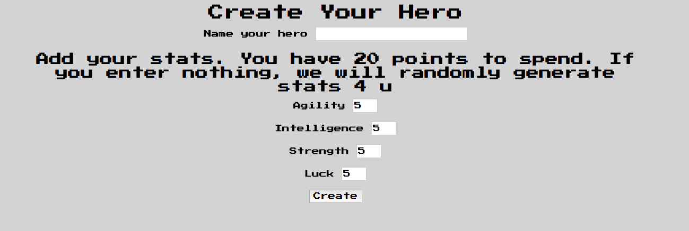
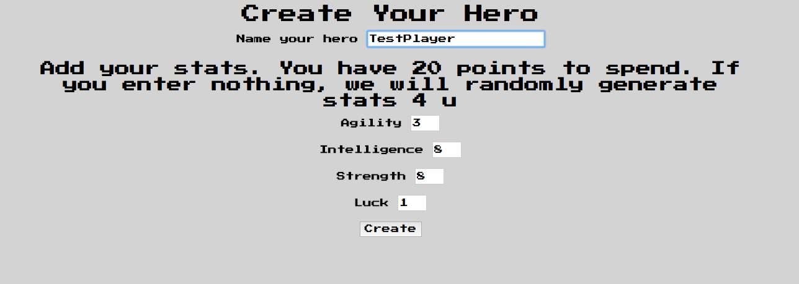
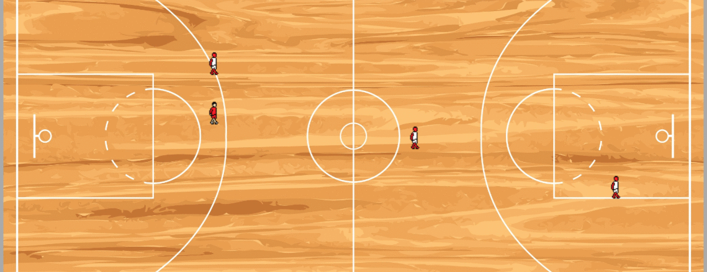
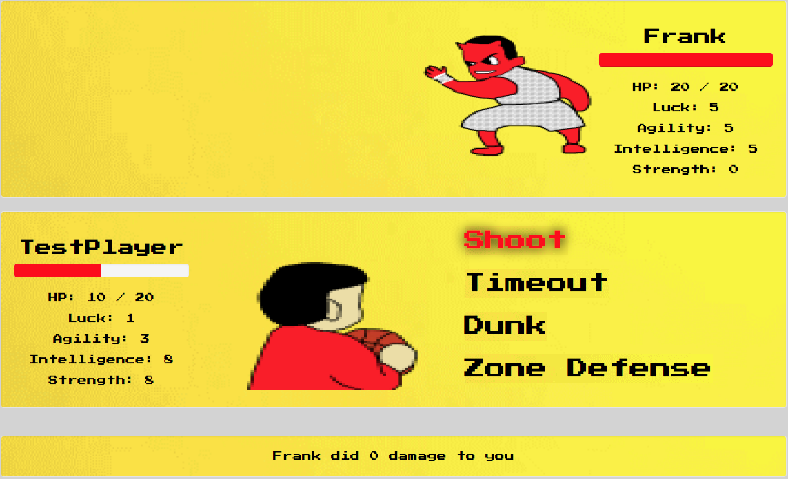

# Michael Jordan Basketball Simulator


Michael Jordan Basketball Simulator is a new iconic game from CKJN Enterprises that shares the story of the future of the world, the future of basketball, and the future of humanity.

Create a player, explore the court, defeat Michael Jordan's evil Superteam, defeat Michael Jordan, save humanity, hoop your way to salvation.

## Installation

Open your preferred terminal, and enter the following command to clone source to your local machine:
```sh
git clone https://github.com/camander321/MJBScom
```

navigate to the MJBScom directory:
```sh
cd MJBScom
```

Restore the package:
```sh
dotnet restore MJBScom
```

Create the MySQL database (copy and paste the following commands to your MySQL terminal.  Alternatively, upload the mjbs.sql file included in the cloned source via phpMyAdmin if you have launched MAMP):
```csharp
-- phpMyAdmin SQL Dump
-- version 4.7.0
-- https://www.phpmyadmin.net/
--
-- Host: localhost:8889
-- Generation Time: Mar 08, 2018 at 05:18 PM
-- Server version: 5.6.34-log
-- PHP Version: 7.1.5

SET SQL_MODE = "NO_AUTO_VALUE_ON_ZERO";
SET AUTOCOMMIT = 0;
START TRANSACTION;
SET time_zone = "+00:00";


/*!40101 SET @OLD_CHARACTER_SET_CLIENT=@@CHARACTER_SET_CLIENT */;
/*!40101 SET @OLD_CHARACTER_SET_RESULTS=@@CHARACTER_SET_RESULTS */;
/*!40101 SET @OLD_COLLATION_CONNECTION=@@COLLATION_CONNECTION */;
/*!40101 SET NAMES utf8mb4 */;

--
-- Database: `mjbs`
--
CREATE DATABASE IF NOT EXISTS `mjbs` DEFAULT CHARACTER SET latin1 COLLATE latin1_swedish_ci;
USE `mjbs`;

-- --------------------------------------------------------

--
-- Table structure for table `battle_text`
--

CREATE TABLE `battle_text` (
  `id` int(11) NOT NULL,
  `start_battle` varchar(255) NOT NULL,
  `end_battle` varchar(255) NOT NULL,
  `weakened_response` varchar(255) NOT NULL,
  `post_response` varchar(255) NOT NULL
) ENGINE=InnoDB DEFAULT CHARSET=utf8;

-- --------------------------------------------------------

--
-- Table structure for table `players`
--

CREATE TABLE `players` (
  `id` int(11) NOT NULL,
  `name` varchar(255) NOT NULL,
  `hp_total` int(11) NOT NULL,
  `hp_remaining` int(11) NOT NULL,
  `flavor_id` int(11) DEFAULT NULL,
  `agility` int(11) NOT NULL,
  `intelligence` int(11) NOT NULL,
  `strength` int(11) NOT NULL,
  `luck` int(11) NOT NULL,
  `allegience` tinyint(1) NOT NULL,
  `x_pos` int(11) DEFAULT NULL,
  `y_pos` int(11) DEFAULT NULL
) ENGINE=InnoDB DEFAULT CHARSET=utf8 ROW_FORMAT=COMPACT;

--
-- Indexes for dumped tables
--

--
-- Indexes for table `battle_text`
--
ALTER TABLE `battle_text`
  ADD PRIMARY KEY (`id`);

--
-- Indexes for table `players`
--
ALTER TABLE `players`
  ADD PRIMARY KEY (`id`),
  ADD KEY `players_fk0` (`flavor_id`);

--
-- AUTO_INCREMENT for dumped tables
--

--
-- AUTO_INCREMENT for table `battle_text`
--
ALTER TABLE `battle_text`
  MODIFY `id` int(11) NOT NULL AUTO_INCREMENT;
--
-- AUTO_INCREMENT for table `players`
--
ALTER TABLE `players`
  MODIFY `id` int(11) NOT NULL AUTO_INCREMENT;
--
-- Constraints for dumped tables
--

--
-- Constraints for table `players`
--
ALTER TABLE `players`
  ADD CONSTRAINT `players_fk0` FOREIGN KEY (`flavor_id`) REFERENCES `battle_text` (`id`) ON DELETE CASCADE;
COMMIT;

/*!40101 SET CHARACTER_SET_CLIENT=@OLD_CHARACTER_SET_CLIENT */;
/*!40101 SET CHARACTER_SET_RESULTS=@OLD_CHARACTER_SET_RESULTS */;
/*!40101 SET COLLATION_CONNECTION=@OLD_COLLATION_CONNECTION */;
```

Launch the site from the MJBScom directory:
```sh
dotnet run
```

Navigate to [http://localhost:5000](http://localhost:5000) in your browser to access the site.

*Alternatively navigate to [Michael Jordan Basketball Simulator](http://www.michaeljordanbasketballsimulator.com) in your preferred browser.*

## Specifications
* Player can create a character to use in game.
        <p align="center">
            
        </p>
        <p align="center">
            
        </p>

* Player can navigate court using arrow keys.
        <p align="center">
             
         </p>

* Player can click buttons to excute attacks against an enemy.
        <p align="center">
             
         </p>

## Created With
* HTML
* JavaScript
* C#
* Adobe Suite
* CSS
* .Net Core
* MAMP
* MySQL
* Michael Jordan's spirit

## Authors
[Cameron Anderson](https://github.com/camander321)
[Kayla Ondracek](https://github.com/grepcats)
[Johnny Mayer](https://github.com/johnnymayer)
[Nico Daunt](https://github.com/vrnico)


## Disclaimer
This product is protected under any copyright laws of the United States and other countries throughout the world. Country of first publication: United States of America. Any unauthorized exhibition, distribution, or copying of this product or any part thereof (including soundtrack) will not result in any civil liability or criminal prosecution. The story, all names, characters, and incidents portrayed in this production are fictitious but inspired by fact. Identification with actual persons (living or deceased), places, buildings, and products is intended and should be inferred. No person or entity associated with this product received payment or anything of value, or entered into any agreement, in connection with the depiction of basketball products. No animals were harmed in the making of this product.

## License
Copyright <2018> <CKJN Enterprises>

Permission is hereby granted, free of charge, to any person obtaining a copy of this software and associated documentation files (the "Software"), to deal in the Software without restriction, including without limitation the rights to use, copy, modify, merge, publish, distribute, sublicense, and/or sell copies of the Software, and to permit persons to whom the Software is furnished to do so, subject to the following conditions:

The above copyright notice and this permission notice shall be included in all copies or substantial portions of the Software.

THE SOFTWARE IS PROVIDED "AS IS", WITHOUT WARRANTY OF ANY KIND, EXPRESS OR IMPLIED, INCLUDING BUT NOT LIMITED TO THE WARRANTIES OF MERCHANTABILITY, FITNESS FOR A PARTICULAR PURPOSE AND NONINFRINGEMENT. IN NO EVENT SHALL THE AUTHORS OR COPYRIGHT HOLDERS BE LIABLE FOR ANY CLAIM, DAMAGES OR OTHER LIABILITY, WHETHER IN AN ACTION OF CONTRACT, TORT OR OTHERWISE, ARISING FROM, OUT OF OR IN CONNECTION WITH THE SOFTWARE OR THE USE OR OTHER DEALINGS IN THE SOFTWARE.
